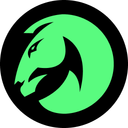

# stallion

<br/>

VSCode extension to send scripts to [Cavalry](https://cavalry.scenegroup.co/).

## Features

-   Send scripts to Cavalry
-   Apply JavaScript expressions to JavaScript layers
-   Insert Cavalry's Typescript definitions
-   Automatically installs the Stallion script
-   Functions as an API for other tools

## Requirements

-   [VSCode](https://code.visualstudio.com/)
-   [Cavalry](https://cavalry.scenegroup.co/) 1.5.2+

## Installation

Install [Stallion from the marketplace](https://marketplace.visualstudio.com/items?itemName=Scenery.cavalry-bridge) or look for "Stallion" in the VSCode extension tab and click the `install` button.

## Usage

To send scripts to Cavalry the Stallion script needs to be open in Cavalry. After the extension is installed, the Stallion script should be available in Cavalry via `Scripts > Stallion`.

The VSCode extension exposes the following commands to the Command Palette (`View > Command Palette`).

1.  ### Send To Cavalry

    This will send the text from the active editor to Cavalry as a script. It doesn't have to be a saved file. Focus the Cavalry window and check the Log Window for any errors.

    If it was sucessful the Log Window will show:

    ```bash
    [Info]
    JavaScript: Stallion: Script successfully executed
    ```

1.  ### Send To Cavalry As…

    This will send the text from the active editor as an expression to Cavalry. It will apply the expression to the selected layers of the chosen type. If there is no selection it will create a layer of the chosen type.

    Choose to send it as:

    -   JavaScript Shape
    -   JavaScript Utility
    -   JavaScript Modifier
    -   JavaScript Deformer
    -   JavaScript Emitter
    -   SkSL Shader
    -   SkSL Filter

1.  ### Insert Cavalry Types

    This will enable auto-complete for Cavalry's scripting API. It inserts a comment at the top of the open editor which references the latest [cavalry-types](https://github.com/scenery-io/cavalry-types).

## Known Issues

-   The server address and port are hardcoded (`127.0.0.1:8080`). Make sure nothing else is using this port.
-   `ui.scriptLocation` returns a temporary path if the document in VSCode hasn't been saved.

## Sending data to Stallion

While Stallion is open, send a `POST` request to `http://127.0.0.1:8080/post` with the following JSON

```json
{
	"type": "",
	"code": "",
	"path": ""
}
```

### `type`

String. The type of code that's sent. Typically one of the following:

-   `script`
-   `javaScriptShape`
-   `javaScript` (Utility)
-   `javaScriptModifier`
-   `javaScriptDeformer`
-   `javaScriptEmitter`
-   `skslShader`
-   `skslFilter`

### `code`

String. Required when `type` is a JavaScript layer or SkSL layer.

The expression that should be applied to a layer or the code that should be executed when `type` is `script`.

> [!IMPORTANT]
> Sending UI scripts through `code` will result in the UI being appended to the Stallion UI. Use [`path`](#path) instead.

### `path`

String. Required when sending UI scripts.

The absolute path to a script. Mainly used for UI scripts so they're opened in their own window.

## Sponsors

Huge thanks to Cavalry for sponsoring this project! Interested in sponsoring? Send us [a message](https://scenery.io/support).

<picture>
  <source media="(prefers-color-scheme: dark)" srcset="./images/cavalry-white.png">
  
</picture>

#### Icon Credits

The icon is [Horse](https://thenounproject.com/icon/horse-2128337/) by Buztas Linggar from [Noun Project](https://thenounproject.com/)
